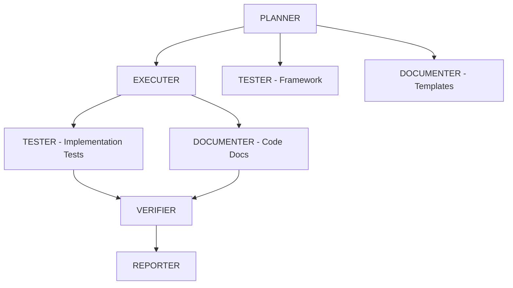

# 🤖 Enhanced Six Agent System

Advanced autonomous and parallel execution for the six-agent development workflow with intelligent coordination and quality control.

## Quick Start

```bash
# Fast autonomous mode (recommended)
./agent-enhanced.sh -f "implement user authentication system"

# Standard usage with options
./agent-enhanced.sh [OPTIONS] "task description"
```

## Execution Modes

### 🚀 **Fast Mode** (`-f`, `--fast`) - RECOMMENDED
Combines autonomous progression with parallel execution for maximum efficiency.

```bash
./agent-enhanced.sh -f "refactor email processing pipeline"
```

**Features:**
- ✅ No human confirmations required
- ✅ Parallel execution where beneficial
- ✅ Auto-iteration for quality < 90%
- ✅ Fastest completion time
- ✅ Quality gates with self-validation

**Best for:** Most development tasks, feature implementation, refactoring

---

### 🤖 **Autonomous Mode** (`-a`, `--autonomous`)
Sequential execution without human confirmation.

```bash
./agent-enhanced.sh -a "implement OAuth authentication"
```

**Features:**
- ✅ No confirmations between phases
- ✅ Sequential agent progression
- ✅ Self-iteration for quality control
- ✅ Predictable execution order

**Best for:** Well-defined tasks, standard implementations, bug fixes

---

### ⚡ **Parallel Mode** (`-p`, `--parallel`)
Concurrent execution with human oversight.

```bash
./agent-enhanced.sh -p "add real-time notifications"
```

**Features:**
- ✅ Compatible tasks run simultaneously
- ✅ Faster than sequential execution
- ✅ Human confirmation at key points
- ✅ Better resource utilization

**Best for:** Complex projects requiring oversight, experimental features

---

### 🛡️ **Conservative Mode** (`-c`, `--conservative`) - DEFAULT
Traditional sequential execution with manual confirmations.

```bash
./agent-enhanced.sh -c "analyze security vulnerabilities"
./agent-enhanced.sh "analyze security vulnerabilities"  # same as -c
```

**Features:**
- ✅ Human oversight at each phase
- ✅ Course correction opportunities
- ✅ Educational value (see decision process)
- ✅ Maximum control

**Best for:** Critical systems, learning, high-risk changes

## Execution Workflow

### Fast Mode Workflow


### Conservative Mode Workflow


## Agent Coordination

### Sequential Dependencies (Always)
- **PLANNER** → Must complete WORK.md before others start
- **VERIFIER** → Requires all components for final validation
- **REPORTER** → Needs complete picture for summary

### Parallel Opportunities
- **TESTER** can start test frameworks while EXECUTER implements
- **DOCUMENTER** can document completed components incrementally
- **EXECUTER** can work on independent modules simultaneously

### Autonomous Triggers

Each agent automatically triggers the next when work meets quality threshold (≥90%):

```bash
# Example auto-triggers
PLANNER: "EXECUTER: Implementation tasks ready in WORK.md. Begin immediately."
EXECUTER: "TESTER: Module authentication complete. DOCUMENTER: API ready for docs."
TESTER: "All tests passing. VERIFIER: Implementation ready for validation."
```

## Quality Control

### Autonomous Quality Gates
- **Code Quality**: No critical issues, follows project patterns
- **Test Coverage**: >90% with meaningful tests
- **Documentation**: Complete and accurate
- **Security**: No vulnerabilities introduced
- **Performance**: Meets or exceeds baselines

### Auto-Iteration Rules
- Quality < 90% → Self-iterate with specific improvements
- Test failures → Fix and re-test automatically
- Integration issues → Resolve and re-validate
- Maximum 2 iteration cycles per agent

## Usage Examples

### Feature Implementation
```bash
# Fast autonomous implementation
./agent-enhanced.sh -f "implement user authentication with JWT tokens"

# Conservative approach for critical features
./agent-enhanced.sh -c "implement payment processing system"
```

### Bug Fixes
```bash
# Quick autonomous fix
./agent-enhanced.sh -a "fix memory leak in data parser"

# Careful investigation
./agent-enhanced.sh -c "resolve intermittent database connection issues"
```

### Refactoring
```bash
# Fast refactoring
./agent-enhanced.sh -f "refactor email processing pipeline for performance"

# Parallel approach for large refactors
./agent-enhanced.sh -p "restructure authentication system architecture"
```

### Analysis & Investigation
```bash
# Autonomous analysis
./agent-enhanced.sh -a "analyze performance bottlenecks in API endpoints"

# Conservative security analysis
./agent-enhanced.sh -c "conduct comprehensive security audit"
```

## File Organization

### Worktree Structure
```
/Agents/agent-[task]-[mode]-[timestamp]/
├── AGENT_MISSION.md           # Generated mission specification
├── WORK.md                    # Coordination hub (created by PLANNER)
├── *AGENT*.md                 # Agent definition files
├── implementation/            # Code created by EXECUTER
├── tests/                     # Test suite from TESTER
├── docs/                      # Documentation from DOCUMENTER
├── verification/              # Reports from VERIFIER
└── summary/                   # Final report from REPORTER
```

### Key Files to Monitor
- **WORK.md** - Central coordination and progress tracking
- **implementation/** - Core code and features
- **tests/** - Test coverage and validation
- **verification/report.md** - Quality scores and validation

## Connection & Monitoring

### Connecting to Active Session
```bash
# Standard tmux
tmux attach -t [session-name]

# iTerm2 native windows
tmux -CC attach -t [session-name]
```

### Progress Monitoring
```bash
# Quick progress check
tmux capture-pane -t [session-name] -S -20 -p

# Watch coordination file
watch -n 3 'ls -la [worktree-path]/WORK.md 2>/dev/null'

# Monitor file creation
watch -n 5 'find [worktree-path] -name "*.md" -o -name "*.js" -o -name "*.py" | head -10'
```

### Real-time Monitoring Commands
```bash
# Watch agent output
tmux capture-pane -t [session] -S -50 -p | tail -20

# Monitor quality scores
grep -r "Score:" [worktree-path]/ 2>/dev/null || echo "No scores yet"

# Check completion status
grep -r "COMPLETED\|✅" [worktree-path]/WORK.md 2>/dev/null || echo "In progress"
```

## Performance Comparison

| Mode | Speed | Quality | Oversight | Best For |
|------|-------|---------|-----------|----------|
| **Fast** | ⚡⚡⚡⚡ | ⭐⭐⭐⭐ | ⭐⭐ | Standard development |
| **Autonomous** | ⚡⚡⚡ | ⭐⭐⭐⭐ | ⭐⭐⭐ | Well-defined tasks |
| **Parallel** | ⚡⚡⚡ | ⭐⭐⭐⭐ | ⭐⭐⭐⭐ | Complex projects |
| **Conservative** | ⚡⚡ | ⭐⭐⭐⭐⭐ | ⭐⭐⭐⭐⭐ | Critical systems |

## Advanced Usage

### Environment Requirements
- Git repository (for worktree creation)
- tmux (session management)
- Claude CLI with `--dangerously-skip-permissions`
- Agent definition files (`*AGENT*.md`)

### Error Recovery
```bash
# If agents get stuck, check current status
tmux capture-pane -t [session] -p

# Provide clarification
tmux send-keys -t [session] "Continue with implementation of authentication module" Enter

# Force next agent (if needed)
tmux send-keys -t [session] "EXECUTER: Begin implementation phase now" Enter
```

### Cleanup After Completion
```bash
# Copy results to main repository
cp -r [worktree-path]/implementation/* ./src/
cp -r [worktree-path]/tests/* ./tests/
cp -r [worktree-path]/docs/* ./docs/

# Remove worktree and session
git worktree remove [worktree-path] --force
tmux kill-session -t [session-name]
```

## Troubleshooting

### Common Issues

**Agents waiting for confirmation in autonomous mode:**
- Verify mission file includes autonomous instructions
- Check WORK.md for quality gate status
- Send explicit continue command via tmux

**Parallel tasks not starting:**
- Ensure PLANNER has completed WORK.md
- Check agent dependencies in mission file
- Verify sufficient system resources

**Quality iterations stuck:**
- Review failing quality criteria
- Check test output for specific failures
- Provide additional context via tmux

### Debug Commands
```bash
# Check mission configuration
cat [worktree-path]/AGENT_MISSION.md | grep -A 5 "EXECUTION MODE"

# View agent progress
grep -r "Agent:" [worktree-path]/ | tail -10

# Check quality scores
grep -r "Score\|Quality\|Threshold" [worktree-path]/
```

## Tips for Success

### Mode Selection Strategy
- 🚀 **Use Fast Mode** for 80% of development tasks
- 🤖 **Use Autonomous** for simple, well-defined work
- ⚡ **Use Parallel** for complex projects needing speed
- 🛡️ **Use Conservative** for critical or experimental changes

### Task Description Best Practices
- Be specific about requirements and constraints
- Include context about existing systems
- Mention performance or security requirements
- Specify preferred technologies or approaches

### Quality Optimization
- Let agents complete their quality iterations
- Monitor WORK.md for coordination status
- Trust the autonomous quality gates
- Intervene only when agents are truly stuck

---

**Remember:** The enhanced agent system is designed for autonomous operation. The more specific and clear your task description, the better the autonomous execution will be. Trust the quality gates and let the agents coordinate! 🚀
