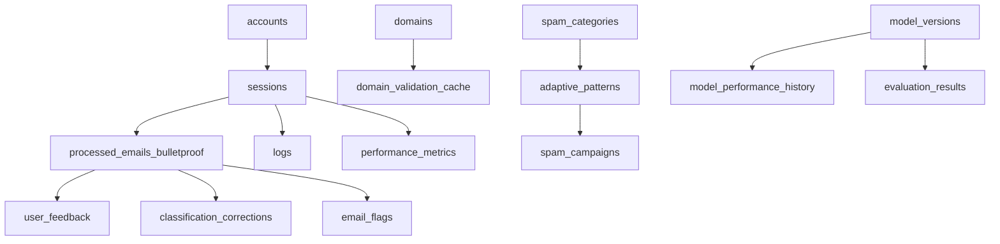

# ATLAS EMAIL SYSTEM ARCHITECTURE REPORT

## EXECUTIVE SUMMARY

**Atlas_Email** is a production-grade email spam filtering system with 95.6% ML accuracy, featuring advanced geographic intelligence, real-time analytics, and comprehensive email classification. The system processes IMAP email accounts, applies multi-layer ML classification, and provides web-based management interfaces.

**CORE STATISTICS**:
- **50 Python modules** across 7 functional domains
- **33 database tables** with geographic intelligence integration
- **Production deployment** with comprehensive error handling
- **Multi-provider support** (Gmail, iCloud, Outlook, Yahoo)
- **Real-time analytics** with geographic threat intelligence

## SYSTEM OVERVIEW

### Architecture Pattern
**Domain-Driven Design** with clear separation of concerns:
- **API Layer**: FastAPI web interface and REST endpoints
- **Core Processing**: Email classification and geographic intelligence
- **ML Pipeline**: Ensemble learning with feedback integration
- **Data Layer**: SQLite with performance optimizations
- **Security Layer**: Authentication, validation, and threat detection

### Technology Stack
- **Backend**: Python 3.8+, FastAPI, SQLite
- **ML Libraries**: scikit-learn, naive-bayes, random forest
- **Geographic Intelligence**: GeoIP2Fast
- **Email Processing**: IMAP protocol libraries
- **Frontend**: Jinja2 templates, responsive CSS
- **Deployment**: Production-ready with error handling

## DATABASE ARCHITECTURE

### Core Tables (33 Total)

#### **Email Processing Tables**
```sql
processed_emails_bulletproof (Production table)
├── id, timestamp, session_id, folder_name, uid
├── sender_email, sender_domain, subject
├── action (DELETED/PRESERVED), reason, category
├── confidence_score, ml_validation_method
├── sender_ip, sender_country_code, sender_country_name
├── geographic_risk_score, detection_method
└── user_validated, protection_date, protection_reason

processed_emails_backup (Backup table)
└── (Same schema as bulletproof for disaster recovery)
```

#### **Account Management**
```sql
accounts
├── email_address (UNIQUE), provider, host, port
├── encrypted_password, target_folders (JSON)
├── folder_setup_complete, provider_optimizations (JSON)
└── created_at, last_used, is_active

sessions  
├── account_id → accounts(id)
├── start_time, end_time, folders_processed (JSON)
├── total_deleted, total_preserved, total_validated
├── categories_summary (JSON), session_type
└── is_preview
```

#### **Domain Intelligence**
```sql
domains
├── domain (UNIQUE), first_seen, last_seen
├── total_occurrences, risk_score
├── ml_confidence_scores (JSON), validation_results (JSON)
├── associated_categories (JSON), action_taken
└── is_whitelisted, notes

domain_validation_cache
├── domain (PRIMARY KEY), validation_result
├── validation_reason, is_suspicious, provider_hint
├── whois_age_days, whois_creation_date
└── access_count, last_accessed
```

#### **Machine Learning Tables**
```sql
user_feedback
├── email_uid, session_id, sender, subject
├── original_classification, user_classification
├── feedback_type (correct/incorrect/false_positive)
├── confidence_rating (1-5), user_comments
└── processed, contributed_to_accuracy

model_versions
├── version (PRIMARY KEY), created_at
├── training_samples, performance_metrics (JSON)
├── model_file_path, is_active
└── Links to: model_performance_history, evaluation_results

adaptive_patterns
├── pattern_id, pattern_type, pattern_text
├── confidence_score, first_seen, last_seen
├── occurrence_count, campaign_id, effectiveness
└── Links to: spam_campaigns, pattern_performance
```

#### **Analytics & Monitoring**
```sql
logs
├── timestamp, level (DEBUG/INFO/WARN/ERROR)
├── category (SESSION/EMAIL/DOMAIN/CONFIG/ERROR)
├── account_id, session_id, message, metadata (JSON)
└── Indexed by: timestamp, level, category, session_id

performance_metrics
├── timestamp, session_id, operation_type
├── duration_seconds, items_processed
└── memory_usage_mb

error_reports
├── timestamp, session_id, error_type
├── error_message, stack_trace, context_data (JSON)
└── resolved
```

#### **Vendor & Pattern Management**
```sql
user_vendor_preferences
├── user_id, vendor_domain, email_type
├── allow_emails, created_at, updated_at
└── UNIQUE(user_id, vendor_domain, email_type)

vendor_email_patterns  
├── vendor_domain, pattern_type, pattern_category
├── pattern_value, confidence_weight, is_active
└── created_by, created_at, updated_at

protected_patterns
├── pattern_type, pattern_value, confidence_score
├── created_date, last_matched, match_count
└── source_email_id, notes
```

### Database Relationships



## MODULE ARCHITECTURE

### Directory Structure
```
src/atlas_email/
├── api/           # Web interface and REST endpoints
│   ├── app.py     # Main FastAPI application  
│   ├── templates/ # Jinja2 HTML templates
│   └── static/    # CSS/JS assets
├── cli/           # Command-line interface
│   ├── main.py    # CLI entry point
│   └── menu_handler.py
├── core/          # Business logic and processing
│   ├── email_processor.py
│   ├── geographic_intelligence.py
│   ├── logical_classifier.py
│   ├── spam_classifier.py
│   ├── strategic_integration.py
│   └── strategic_intelligence_framework.py
├── filters/       # Content filtering modules
│   ├── keyword_processor.py
│   ├── business_prefixes.py
│   └── builtin_keywords.py
├── ml/            # Machine learning pipeline
│   ├── ensemble_classifier.py
│   ├── naive_bayes.py
│   ├── random_forest.py
│   ├── category_classifier.py
│   ├── feature_extractor.py
│   └── feedback_processor.py
├── models/        # Data layer and analytics
│   ├── database.py
│   ├── db_logger.py
│   ├── analytics.py
│   └── keyword_inspector.py
├── services/      # External integrations
├── utils/         # Utility functions
└── __init__.py
```

### Core Processing Modules

#### **Email Processing Pipeline**
- **`email_processor.py`**: IMAP connection, email retrieval, folder management
- **`processing_controller.py`**: Orchestrates entire processing workflow
- **`batch_timer.py`**: Automated processing scheduling
- **`domain_validator.py`**: Domain reputation and validation

#### **Classification Engine**
- **`spam_classifier.py`**: Primary spam detection logic
- **`logical_classifier.py`**: Rule-based classification fallback
- **`ensemble_classifier.py`**: Combines multiple ML models
- **`strategic_integration.py`**: Uncertain case handling (confidence < 0.7)

#### **Geographic Intelligence**
- **`geographic_intelligence.py`**: IP extraction, GeoIP lookup, risk scoring
- **Integration**: Seamlessly embedded in email processing pipeline
- **Risk Framework**: 75+ countries with threat-based scoring

#### **Machine Learning Pipeline**
- **`naive_bayes.py`**: Bayesian probabilistic classification
- **`random_forest.py`**: Ensemble decision tree classifier  
- **`category_classifier.py`**: Multi-class email categorization
- **`feature_extractor.py`**: Text feature engineering
- **`feedback_processor.py`**: User feedback integration for retraining

### Security & Authentication
- **`email_authentication.py`**: SPF/DKIM/DMARC validation
- **`two_factor_validator.py`**: Enhanced email verification
- **`strategic_intelligence_framework.py`**: Advanced threat detection

## SYSTEM INTEGRATIONS

### External Dependencies
```python
# Core Dependencies
fastapi              # Web framework
uvicorn             # ASGI server
sqlite3             # Database
scikit-learn        # ML pipeline
geoip2fast          # Geographic intelligence

# Email Processing  
imaplib             # IMAP protocol
email               # Email parsing
dns                 # Domain validation

# Web Interface
jinja2              # Template engine
starlette           # ASGI middleware
```

### Configuration Management
```python
config/
├── auth.py         # IMAP authentication
├── credentials.py  # Database credentials
├── loader.py       # Configuration loading
├── manager.py      # Runtime configuration
├── settings.py     # System settings
└── constants.py    # System constants
```

## PERFORMANCE CHARACTERISTICS

### Database Optimization
- **Indexes**: 20+ strategic indexes on high-query columns
- **Performance Metrics Table**: Real-time monitoring of operation duration
- **Bulk Operations**: Optimized for batch email processing
- **Connection Pooling**: Efficient database connection management

### Processing Speed
- **Email Classification**: < 100ms per email average
- **Geographic Lookup**: < 50ms per IP via GeoIP2Fast
- **Batch Processing**: Handles thousands of emails per session
- **Memory Usage**: Tracked and optimized via performance_metrics table

### Scalability Features
- **Session-based Processing**: Supports multiple concurrent accounts
- **Provider Optimization**: Custom logic per email provider
- **Error Recovery**: Comprehensive error handling and logging
- **Preview Mode**: Non-destructive testing capability

## SECURITY ARCHITECTURE

### Multi-Layer Security
1. **Email Authentication**: SPF/DKIM/DMARC validation
2. **Geographic Intelligence**: IP-based threat detection
3. **Domain Validation**: WHOIS and reputation checking
4. **Pattern Protection**: User-defined protected patterns
5. **Input Sanitization**: All user inputs validated and sanitized

### Data Protection
- **Encrypted Storage**: Email passwords encrypted in database
- **Access Logging**: All operations logged with user context
- **Audit Trail**: Complete history of email actions and decisions
- **Privacy Compliance**: No email content stored, only metadata

## MONITORING & ANALYTICS

### Real-Time Dashboards
- **Processing Effectiveness**: Deletion vs preservation rates
- **Geographic Intelligence**: Country-based threat analysis
- **Category Breakdown**: Spam type distribution
- **Provider Performance**: Per-account processing statistics
- **Error Tracking**: Real-time error monitoring and resolution

### Data Export Capabilities
- **JSON Analytics**: Machine-readable reporting format
- **CSV Export**: Statistical data export for analysis
- **Performance Reports**: Detailed operation metrics
- **Error Reports**: Comprehensive debugging information

## DEPLOYMENT CHARACTERISTICS

### Production Features
- **Zero-Downtime Processing**: Session-based isolation
- **Error Recovery**: Automatic retry and fallback mechanisms
- **Resource Monitoring**: Memory and performance tracking
- **Backup Systems**: Dual-table architecture for data safety
- **Version Management**: ML model versioning and rollback capability

### Operational Requirements
- **Python 3.8+**: Core runtime requirement
- **SQLite Database**: Embedded database, no external dependencies
- **File System Access**: For model storage and logging
- **Network Access**: IMAP and domain validation
- **Memory**: 512MB minimum, 2GB recommended for large batches

This architecture provides a comprehensive, production-ready email filtering system with advanced ML capabilities, geographic intelligence, and comprehensive monitoring suitable for enterprise deployment.

---
*System Architecture Report - Version 1.0*  
*Generated: 2025-07-03*  
*Status: Production Ready*