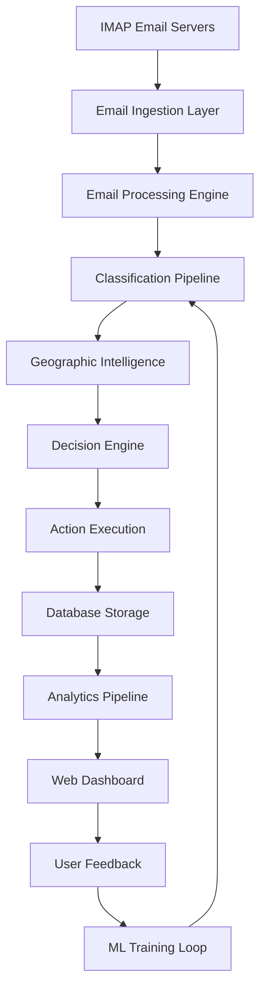
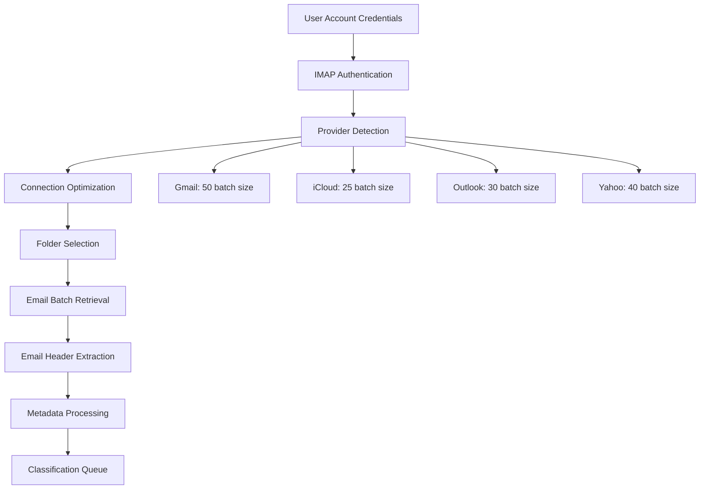
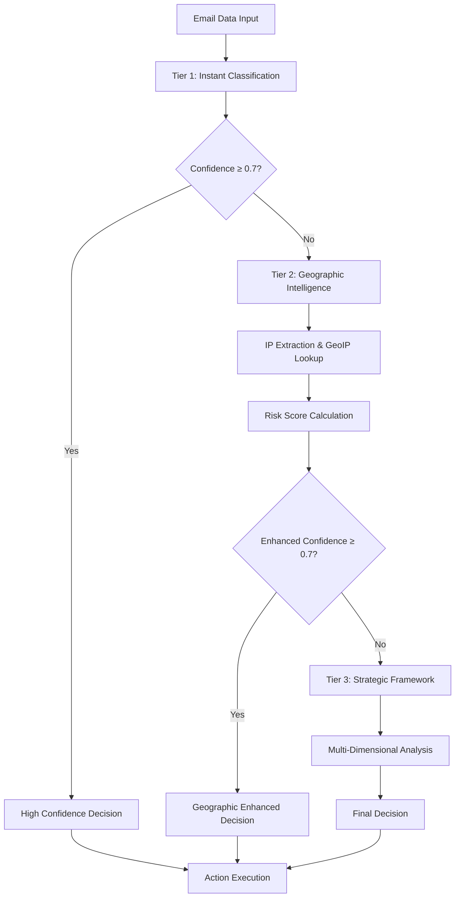
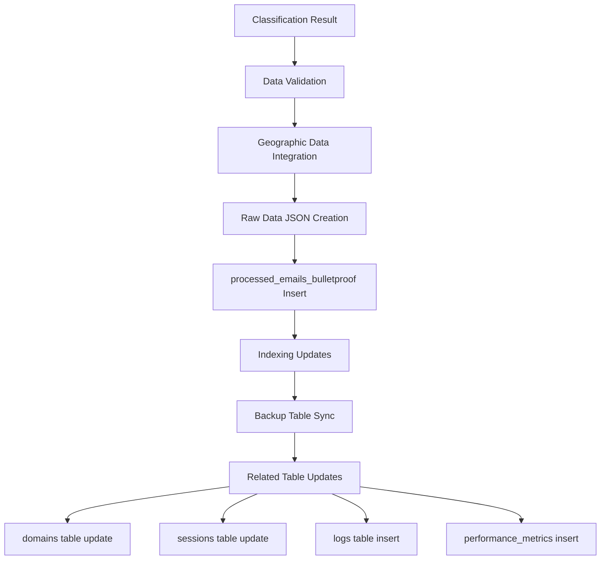
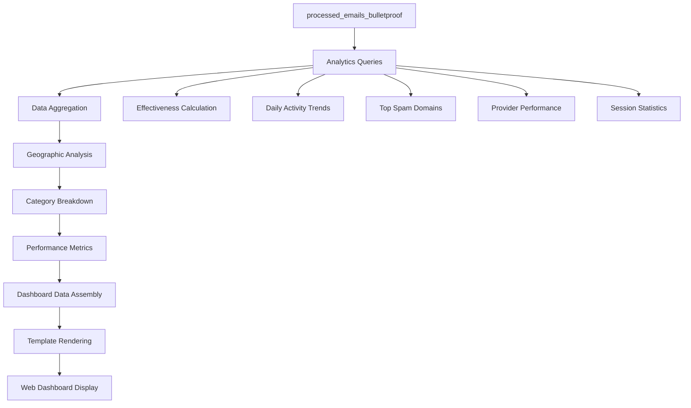
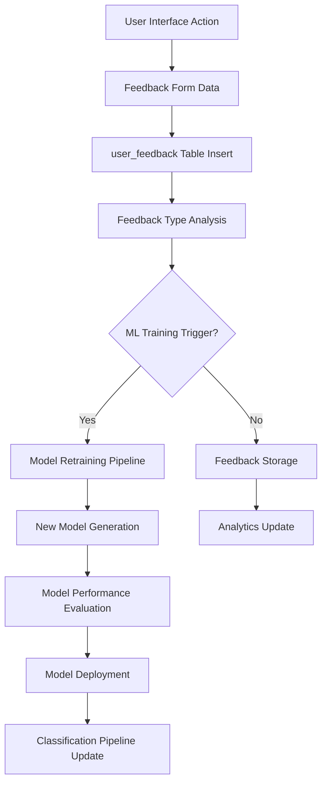
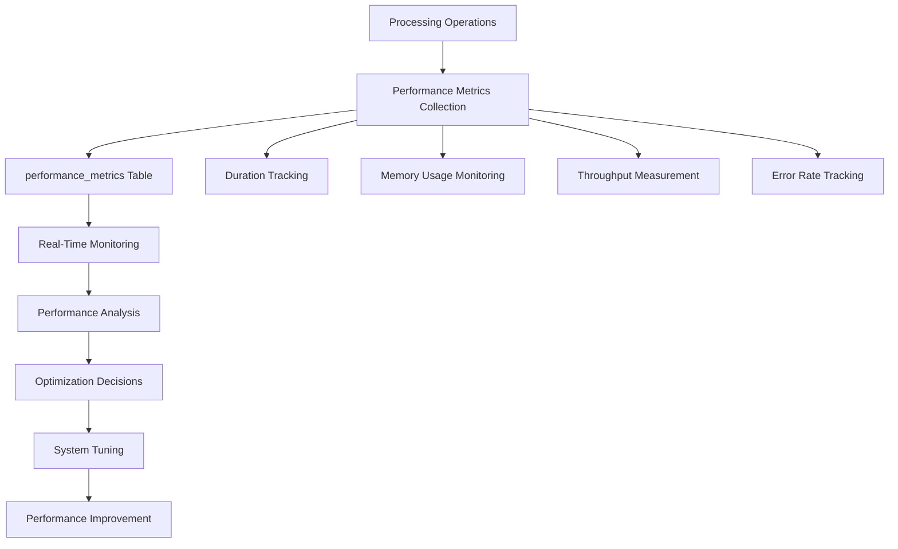

# ATLAS EMAIL DATA FLOW DIAGRAM

## EXECUTIVE SUMMARY

**Atlas_Email** implements a comprehensive data flow architecture spanning email ingestion, classification processing, geographic intelligence, machine learning feedback loops, and analytics generation. The system processes data through multiple stages with persistent storage, real-time analytics, and continuous learning capabilities.

**DATA FLOW CHARACTERISTICS**:
- **Multi-Stage Processing**: Email ingestion → Classification → Storage → Analytics
- **Real-Time Processing**: < 100ms average email classification
- **Persistent Storage**: SQLite with 33 tables and strategic indexing
- **Feedback Loops**: User feedback integration for ML model improvement
- **Analytics Pipeline**: Real-time dashboard with geographic intelligence

## OVERALL SYSTEM DATA FLOW

### High-Level Data Architecture


## EMAIL INGESTION DATA FLOW

### IMAP Connection and Processing


#### Email Data Extraction
```python
# Email ingestion data structure
EmailData = {
    "uid": "unique_email_identifier",
    "folder_name": "INBOX",
    "sender_email": "sender@domain.com",
    "sender_domain": "domain.com", 
    "subject": "email_subject",
    "headers": "complete_email_headers",
    "timestamp": "2025-07-03T10:30:00Z",
    "account_id": 1,
    "session_id": 123
}
```

### Provider-Specific Data Flow
```python
# Provider optimization settings flow
provider_settings = {
    'icloud': {
        'batch_size': 25,
        'use_bulk_operations': True,
        'skip_individual_marking': True
    },
    'gmail': {
        'batch_size': 50,
        'use_bulk_operations': False,
        'skip_individual_marking': False
    }
}
```

## CLASSIFICATION DATA FLOW

### 3-Tier Classification Pipeline


#### Tier 1 Data Flow: Ensemble ML Classification
```python
# Feature extraction data flow
features = {
    "text_features": extract_text_features(subject, sender),
    "domain_features": analyze_domain_reputation(sender_domain),
    "pattern_features": detect_spam_patterns(subject, headers),
    "authentication_features": check_spf_dkim_dmarc(headers)
}

# ML ensemble processing
ensemble_results = {
    "random_forest": random_forest.predict(features),
    "naive_bayes": naive_bayes.predict(features),
    "keyword_processor": keyword_processor.classify(subject, sender)
}

# Confidence aggregation
final_result = aggregate_ensemble_confidence(ensemble_results)
```

#### Tier 2 Data Flow: Geographic Intelligence
```python
# Geographic processing pipeline
geographic_flow = {
    "ip_extraction": extract_ip_from_headers(headers),
    "geoip_lookup": geoip2fast.lookup(sender_ip),
    "country_identification": resolve_country_code(geoip_result),
    "risk_scoring": apply_country_risk_score(country_code),
    "confidence_enhancement": adjust_confidence_with_geo(base_confidence, risk_score)
}
```

#### Tier 3 Data Flow: Strategic Framework
```python
# Strategic analysis dimensions
strategic_analysis = {
    "authentication_score": validate_email_authentication(headers),
    "business_score": assess_business_legitimacy(sender, domain),
    "content_score": analyze_content_sophistication(subject, body),
    "geographic_score": geographic_threat_assessment(geo_data),
    "network_score": analyze_network_reputation(sender_ip)
}
```

## DATABASE STORAGE DATA FLOW

### Primary Storage Pipeline


#### Complete Storage Record
```sql
-- processed_emails_bulletproof data flow
INSERT INTO processed_emails_bulletproof (
    timestamp,              -- Processing timestamp
    session_id,             -- Session tracking
    folder_name,            -- Source folder
    uid,                    -- Email unique ID
    sender_email,           -- From field
    sender_domain,          -- Extracted domain
    subject,                -- Email subject
    action,                 -- DELETED/PRESERVED
    reason,                 -- Classification reason
    category,               -- Spam category
    confidence_score,       -- ML confidence (0.0-1.0)
    ml_validation_method,   -- Tier used
    raw_data,               -- Complete JSON data
    sender_ip,              -- Geographic data
    sender_country_code,    -- Country code
    sender_country_name,    -- Country name
    geographic_risk_score,  -- Geographic risk
    detection_method        -- IP detection method
)
```

### Related Data Flows
```python
# Concurrent data updates
domain_update = {
    "domain": sender_domain,
    "last_seen": current_timestamp,
    "total_occurrences": increment_count(),
    "risk_score": update_risk_score(),
    "action_taken": current_action
}

session_update = {
    "total_deleted": increment_if_deleted(),
    "total_preserved": increment_if_preserved(),
    "categories_summary": update_category_counts()
}

performance_metrics = {
    "operation_type": "email_classification",
    "duration_seconds": processing_time,
    "items_processed": 1,
    "memory_usage_mb": current_memory_usage()
}
```

## GEOGRAPHIC INTELLIGENCE DATA FLOW

### IP to Geographic Data Pipeline
```mermaid
graph TD
    A[Email Headers] --> B[IP Extraction Patterns]
    B --> C[External IP Validation]
    C --> D[GeoIP2Fast Lookup]
    D --> E[Country Resolution]
    E --> F[Risk Score Assignment]
    F --> G[Geographic Data Object]
    G --> H[Database Storage]
    H --> I[Analytics Integration]
    
    B --> B1[Received header [IP] pattern]
    B --> B2[Received header (IP) pattern]
    B --> B3[X-Originating-IP pattern]
    B --> B4[X-Sender-IP pattern]
```

#### Geographic Data Structure
```python
# Complete geographic data flow
GeographicData = {
    "sender_ip": "203.0.113.123",
    "sender_country_code": "US",
    "sender_country_name": "United States",
    "geographic_risk_score": 0.10,
    "detection_method": "GEOIP2FAST_LOOKUP",
    "country_risk_level": "very_low",
    "threat_assessment": {
        "risk_category": "low_risk_country",
        "spam_likelihood": 0.15,
        "threat_indicators": []
    }
}
```

### Country Risk Scoring Flow
```python
# Risk scoring data pipeline
risk_calculation = {
    "country_lookup": COUNTRY_RISK_SCORES.get(country_code, 0.30),
    "base_confidence": original_classification_confidence,
    "geographic_modifier": calculate_geographic_modifier(risk_score),
    "enhanced_confidence": base_confidence * geographic_modifier,
    "risk_level_assignment": assign_risk_level(final_score)
}
```

## ANALYTICS DATA FLOW

### Real-Time Analytics Pipeline


#### Analytics Data Queries
```sql
-- Effectiveness metrics data flow
SELECT 
    COUNT(CASE WHEN action = 'DELETED' THEN 1 END) as deleted_count,
    COUNT(CASE WHEN action = 'PRESERVED' THEN 1 END) as preserved_count,
    COUNT(*) as total_count
FROM processed_emails_bulletproof 
WHERE datetime(timestamp) > datetime('now', '-30 days');

-- Geographic intelligence analytics
SELECT 
    sender_country_code,
    sender_country_name,
    COUNT(*) as count,
    COUNT(*) * 100.0 / SUM(COUNT(*)) OVER() as percentage,
    AVG(geographic_risk_score) as avg_risk_score
FROM processed_emails_bulletproof 
WHERE sender_country_code IS NOT NULL
GROUP BY sender_country_code, sender_country_name
ORDER BY count DESC LIMIT 15;
```

#### Dashboard Data Structure
```python
# Complete analytics data flow
analytics_data = {
    "effectiveness": {
        "total_count": 1250,
        "deleted_count": 856, 
        "preserved_count": 394,
        "effectiveness_rate": 68.5
    },
    "geographic_data": [
        {
            "country_code": "US",
            "country_name": "United States", 
            "count": 105,
            "percentage": 42.3,
            "avg_risk_score": 0.12
        }
    ],
    "categories": [...],
    "daily_activity": [...],
    "session_stats": {...}
}
```

## USER FEEDBACK DATA FLOW

### Feedback Collection and Processing


#### Feedback Data Structure
```python
# User feedback data flow
feedback_data = {
    "email_uid": "unique_identifier",
    "session_id": 123,
    "sender": "spam@example.com",
    "subject": "Original email subject",
    "original_classification": "Financial Spam",
    "user_classification": "Legitimate",
    "feedback_type": "incorrect",
    "confidence_rating": 4,
    "user_comments": "This was a legitimate bank email",
    "timestamp": "2025-07-03T10:30:00Z",
    "processed": False,
    "contributed_to_accuracy": False
}
```

### ML Training Data Flow
```python
# Model retraining pipeline
training_pipeline = {
    "feedback_collection": get_unprocessed_feedback(),
    "data_preparation": prepare_training_data(feedback),
    "feature_extraction": extract_ml_features(email_data),
    "model_training": retrain_ensemble_models(training_data),
    "cross_validation": validate_model_performance(new_model),
    "model_deployment": deploy_if_improved(validation_results),
    "feedback_marking": mark_feedback_as_processed()
}
```

## PERFORMANCE AND MONITORING DATA FLOW

### System Performance Tracking


#### Performance Data Structure
```python
# Performance monitoring data flow
performance_data = {
    "timestamp": "2025-07-03T10:30:00Z",
    "session_id": 123,
    "operation_type": "email_classification",
    "duration_seconds": 0.087,
    "items_processed": 1,
    "memory_usage_mb": 145.2,
    "tier_performance": {
        "tier_1_percentage": 94.8,
        "tier_2_percentage": 4.1,
        "tier_3_percentage": 1.1
    }
}
```

## ERROR HANDLING DATA FLOW

### Error Tracking and Recovery
```python
# Error handling data flow
error_data = {
    "timestamp": "2025-07-03T10:30:00Z",
    "session_id": 123,
    "error_type": "ClassificationError",
    "error_message": "Geographic lookup failed",
    "stack_trace": "Complete stack trace...",
    "context_data": {
        "email_uid": "failed_email_id",
        "sender": "problematic@domain.com",
        "processing_tier": "tier_2_geographic"
    },
    "recovery_action": "fallback_to_tier_3",
    "resolved": False
}
```

## DATA PERSISTENCE AND BACKUP

### Backup and Recovery Data Flow
```python
# Backup strategy data flow
backup_flow = {
    "primary_table": "processed_emails_bulletproof",
    "backup_table": "processed_emails_backup", 
    "sync_frequency": "real_time",
    "retention_policy": "indefinite",
    "recovery_procedure": "automatic_failover"
}
```

This comprehensive data flow architecture ensures reliable email processing, persistent storage, real-time analytics, and continuous system improvement through machine learning feedback loops.

---
*Data Flow Diagram - Version 1.0*  
*Generated: 2025-07-03*  
*Status: Production Ready*