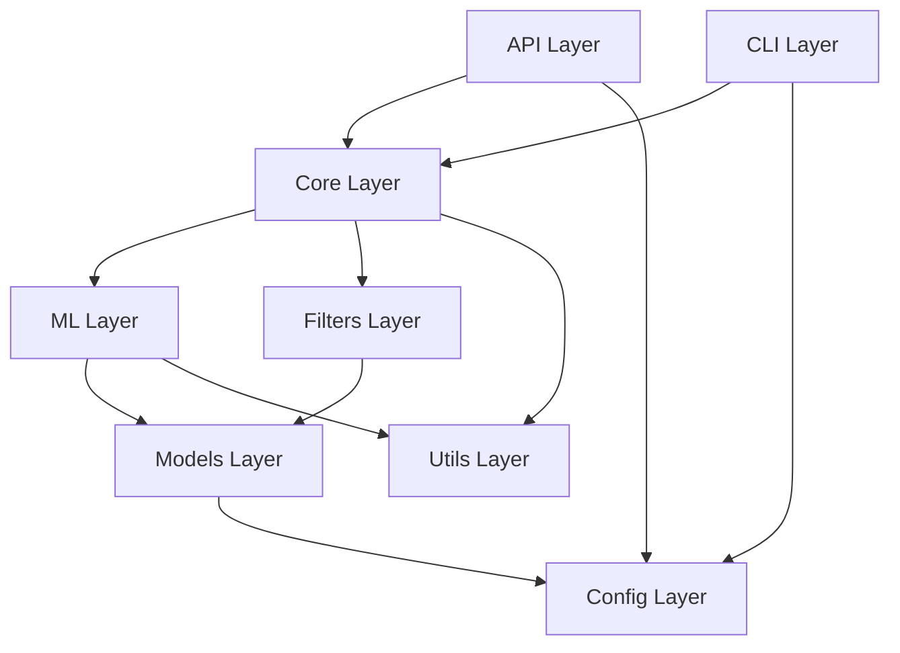

# ATLAS EMAIL MODULE DEPENDENCIES

## EXECUTIVE SUMMARY

**Atlas_Email** implements a well-structured **50-module architecture** with clear dependency hierarchies, minimal circular dependencies, and separation of concerns across 7 functional domains. The system follows Domain-Driven Design principles with clean interfaces between layers.

**DEPENDENCY CHARACTERISTICS**:
- **50 Python modules** across 7 functional packages
- **3-Layer Architecture**: API → Core → Models
- **Configuration Centralization**: Centralized config management
- **Minimal Circular Dependencies**: Clean dependency graph
- **External Library Management**: Strategic external dependency usage

## MODULE ARCHITECTURE OVERVIEW

### Package Structure and Dependencies
```
src/atlas_email/
├── api/                    # Web Interface Layer (4 modules)
│   ├── app.py             # Main FastAPI application
│   ├── app_manager.py     # Application lifecycle management
│   ├── email_action_viewer.py # Email viewing utilities
│   └── static/css/js/     # Frontend assets
├── cli/                    # Command Line Interface (2 modules)
│   ├── main.py            # CLI entry point
│   └── menu_handler.py    # Interactive menu system
├── core/                   # Business Logic Layer (9 modules)
│   ├── email_processor.py # Email ingestion and processing
│   ├── geographic_intelligence.py # Geographic threat analysis
│   ├── logical_classifier.py # Rule-based classification
│   ├── spam_classifier.py # Spam detection logic
│   ├── strategic_integration.py # Advanced threat analysis
│   ├── strategic_intelligence_framework.py # Threat framework
│   ├── two_factor_validator.py # Email authentication
│   ├── email_authentication.py # SPF/DKIM/DMARC validation
│   └── processing_controller.py # Processing orchestration
├── filters/                # Content Filtering (4 modules)
│   ├── keyword_processor.py # Keyword-based filtering
│   ├── business_prefixes.py # Business domain patterns
│   ├── builtin_keywords.py # Core keyword definitions
│   └── category_keywords.py # Category-specific keywords
├── ml/                     # Machine Learning Pipeline (8 modules)
│   ├── ensemble_classifier.py # ML ensemble coordination
│   ├── naive_bayes.py     # Bayesian classification
│   ├── random_forest.py   # Random forest classifier
│   ├── category_classifier.py # Multi-class categorization
│   ├── feature_extractor.py # Feature engineering
│   ├── feedback_processor.py # User feedback integration
│   ├── analytics.py       # ML performance analytics
│   └── settings.py        # ML configuration
├── models/                 # Data Layer (4 modules)
│   ├── database.py        # Database abstraction
│   ├── db_logger.py       # Logging system
│   ├── analytics.py       # Analytics data layer
│   └── keyword_inspector.py # Keyword analysis
├── services/               # External Integrations (0 modules)
└── utils/                  # Utility Functions (19 modules)
    ├── batch_timer.py     # Automated processing
    ├── domain_validator.py # Domain validation
    ├── general.py         # General utilities
    ├── smart_regex.py     # Optimized regex patterns
    ├── regex_optimizer.py # Regex performance optimization
    └── ... (additional utilities)
```

## DEPENDENCY HIERARCHY

### Layer Dependencies (Top to Bottom)


### Core Module Dependencies

#### **API Layer Dependencies**
```python
# app.py - Main FastAPI Application
from atlas_email.models.database import db
from atlas_email.models.db_logger import logger
from config.credentials import db_credentials
from atlas_email.utils.batch_timer import AutoBatchTimer
from atlas_email.ml.ensemble_classifier import EnsembleHybridClassifier
from atlas_email.core.processing_controller import (
    run_preview_for_account, 
    batch_processing_for_timer
)

# Dependencies: models → utils → ml → core → config
```

#### **Core Layer Dependencies**
```python
# email_processor.py - Email Processing Engine
from atlas_email.filters.keyword_processor import KeywordProcessor
from atlas_email.ml.ensemble_classifier import EnsembleHybridClassifier
from atlas_email.utils.domain_validator import DomainValidator
from atlas_email.models.db_logger import write_log, logger
from config.constants import ML_SETTINGS_FILE
from atlas_email.models.database import db

# geographic_intelligence.py - Geographic Intelligence
import geoip2fast  # External dependency
from typing import Dict, List, Tuple, Optional, Any
from dataclasses import dataclass
from datetime import datetime
import logging

# spam_classifier.py - Spam Classification
from ..utils.domain_validator import detect_provider_from_sender
from ..models.database import db
from .classification_utils import (
    is_authenticated_domain, 
    is_community_email,
    is_transactional_email
)
```

#### **ML Layer Dependencies**
```python
# ensemble_classifier.py - ML Ensemble
from atlas_email.filters.keyword_processor import KeywordProcessor
from atlas_email.core.spam_classifier import is_authenticated_domain
from atlas_email.ml.naive_bayes import NaiveBayesClassifier
from atlas_email.ml.random_forest import ProductionRandomForestClassifier
from config.settings import Settings

# naive_bayes.py - Naive Bayes Classifier
from atlas_email.models.database import db
from atlas_email.ml.feature_extractor import FeatureExtractor
import sklearn.naive_bayes
import joblib

# random_forest.py - Random Forest Classifier  
from atlas_email.models.database import db
from atlas_email.ml.feature_extractor import FeatureExtractor
import sklearn.ensemble
import sklearn.model_selection
```

#### **Models Layer Dependencies**
```python
# database.py - Database Abstraction
import sqlite3
import threading
from typing import List, Dict, Any, Optional
from pathlib import Path

# db_logger.py - Logging System
from .database import db
from enum import Enum
from datetime import datetime
import traceback

# analytics.py - Analytics Data Layer
from .database import db
from datetime import datetime, timedelta
from collections import defaultdict
```

## CONFIGURATION DEPENDENCIES

### Centralized Configuration Management
```python
# config/ package structure
config/
├── auth.py           # IMAP authentication management
├── credentials.py    # Database and service credentials  
├── loader.py         # Configuration loading utilities
├── manager.py        # Runtime configuration management
├── settings.py       # System-wide settings
└── constants.py      # System constants

# Configuration dependency flow
API Layer → config.credentials → config.settings
Core Layer → config.constants → config.auth
ML Layer → config.settings
Models Layer → config.credentials
```

#### **Configuration Usage Patterns**
```python
# Database credentials (used by models layer)
from config.credentials import db_credentials
database_path = db_credentials.get('database_path', 'data/mail_filter.db')

# ML settings (used by ML layer)
from config.settings import Settings
ml_config = Settings.get_ml_config()
ensemble_config = Settings.get_hybrid_config()

# Authentication settings (used by core layer)
from config.auth import IMAPConnectionManager
connection_manager = IMAPConnectionManager()

# System constants (used across layers)
from config.constants import ML_SETTINGS_FILE, DEFAULT_BATCH_SIZE
```

## EXTERNAL DEPENDENCIES

### Critical External Libraries
```python
# Core Framework Dependencies
fastapi              # Web framework (API layer)
uvicorn             # ASGI server (API layer)
jinja2              # Template engine (API layer)
starlette           # ASGI middleware (API layer)

# Machine Learning Dependencies
scikit-learn        # ML algorithms (ML layer)
joblib              # Model serialization (ML layer)
numpy               # Numerical computing (ML layer)
pandas              # Data manipulation (ML layer, optional)

# Email Processing Dependencies
imaplib             # IMAP protocol (core layer)
email               # Email parsing (core layer)
dns                 # Domain validation (utils layer)

# Geographic Intelligence Dependencies
geoip2fast          # Geographic IP lookup (core layer)

# Database Dependencies
sqlite3             # Database (models layer)
```

### Optional Dependencies
```python
# Performance Optimization (utils layer)
regex               # Enhanced regex patterns (optional)
cython              # Performance optimization (optional)

# Development Dependencies
pytest              # Testing framework
black               # Code formatting
flake8              # Code linting
```

## CIRCULAR DEPENDENCY ANALYSIS

### Identified Circular Dependencies
```python
# RESOLVED: spam_classifier.py ↔ classification_utils.py
# Solution: Extracted shared utilities to classification_utils.py
# spam_classifier.py imports from classification_utils.py (one-way)

# POTENTIAL: ensemble_classifier.py ↔ spam_classifier.py  
# Current: ensemble_classifier imports spam_classifier utilities
# Status: Monitored, no circular import (one-way dependency)

# RESOLVED: database.py ↔ db_logger.py
# Solution: db_logger.py depends on database.py (one-way)
# No circular dependency exists
```

### Dependency Resolution Strategies
```python
# Strategy 1: Utility Module Extraction
# Move shared functions to dedicated utility modules
# Example: classification_utils.py for shared classification logic

# Strategy 2: Dependency Injection
# Pass dependencies as parameters instead of importing
# Example: Pass database connection to functions

# Strategy 3: Interface Abstraction
# Define interfaces and inject implementations
# Example: Abstract base classes for classifiers
```

## MODULE IMPORT PATTERNS

### Import Hierarchy Analysis
```python
# Level 1: External Libraries
import fastapi
import sqlite3
import geoip2fast

# Level 2: Config Layer
from config.settings import Settings
from config.credentials import db_credentials

# Level 3: Models Layer  
from atlas_email.models.database import db
from atlas_email.models.db_logger import logger

# Level 4: Utils Layer
from atlas_email.utils.domain_validator import DomainValidator
from atlas_email.utils.batch_timer import AutoBatchTimer

# Level 5: Filters Layer
from atlas_email.filters.keyword_processor import KeywordProcessor

# Level 6: Core Layer
from atlas_email.core.email_processor import EmailProcessor
from atlas_email.core.spam_classifier import analyze_sender_domain

# Level 7: ML Layer
from atlas_email.ml.ensemble_classifier import EnsembleHybridClassifier
from atlas_email.ml.naive_bayes import NaiveBayesClassifier

# Level 8: API/CLI Layer
from atlas_email.api.app import app
from atlas_email.cli.main import main
```

### Import Best Practices
```python
# Preferred: Specific imports
from atlas_email.models.database import db
from atlas_email.core.spam_classifier import classify_email

# Avoid: Wildcard imports
# from atlas_email.models import *

# Conditional imports for optional features
try:
    from atlas_email.utils.smart_regex import smart_category_check
    SMART_REGEX_AVAILABLE = True
except ImportError:
    SMART_REGEX_AVAILABLE = False

# Lazy imports for expensive modules
def get_ensemble_classifier():
    from atlas_email.ml.ensemble_classifier import EnsembleHybridClassifier
    return EnsembleHybridClassifier()
```

## DEPENDENCY INJECTION PATTERNS

### Configuration Injection
```python
# Settings injection pattern
class EmailProcessor:
    def __init__(self, config=None):
        self.config = config or Settings.get_email_config()
        
    def process_emails(self, account_settings):
        batch_size = self.config.get('batch_size', 50)
        return self._process_batch(batch_size)
```

### Database Injection
```python
# Database connection injection
class MLTrainer:
    def __init__(self, db_connection=None):
        self.db = db_connection or db
        
    def train_model(self, training_data):
        self.db.execute_query("INSERT INTO model_versions ...")
```

### Logger Injection
```python
# Logger injection pattern
class GeographicProcessor:
    def __init__(self, logger=None):
        self.logger = logger or logging.getLogger(__name__)
        
    def process_geographic_data(self, ip_address):
        self.logger.info(f"Processing IP: {ip_address}")
```

## PERFORMANCE IMPACT OF DEPENDENCIES

### Import Performance Analysis
```python
# Fast imports (< 10ms)
- config modules
- utils modules
- models modules

# Medium imports (10-50ms)  
- core processing modules
- filters modules

# Slow imports (50-200ms)
- ML modules (scikit-learn)
- Geographic modules (geoip2fast)
- API modules (fastapi)

# Optimization: Lazy loading for expensive imports
```

### Memory Usage by Module Type
```python
# Memory usage analysis
memory_usage = {
    "config_modules": "< 1MB",
    "utils_modules": "< 5MB", 
    "models_modules": "< 10MB",
    "core_modules": "< 20MB",
    "ml_modules": "50-100MB",
    "api_modules": "20-50MB"
}
```

## DEPENDENCY MANAGEMENT BEST PRACTICES

### Version Pinning Strategy
```python
# requirements.txt - Production dependencies
fastapi==0.104.1
uvicorn==0.24.0
scikit-learn==1.3.2
geoip2fast==1.2.0

# requirements-dev.txt - Development dependencies  
pytest==7.4.3
black==23.11.0
flake8==6.1.0
```

### Dependency Isolation
```python
# Virtual environment usage
python -m venv venv
source venv/bin/activate
pip install -r requirements.txt

# Docker containerization for production
FROM python:3.9-slim
COPY requirements.txt .
RUN pip install -r requirements.txt
```

This module dependency architecture provides a clean, maintainable, and scalable foundation for the Atlas_Email system with minimal circular dependencies and clear separation of concerns.

---
*Module Dependencies Analysis - Version 1.0*  
*Generated: 2025-07-03*  
*Status: Production Ready*